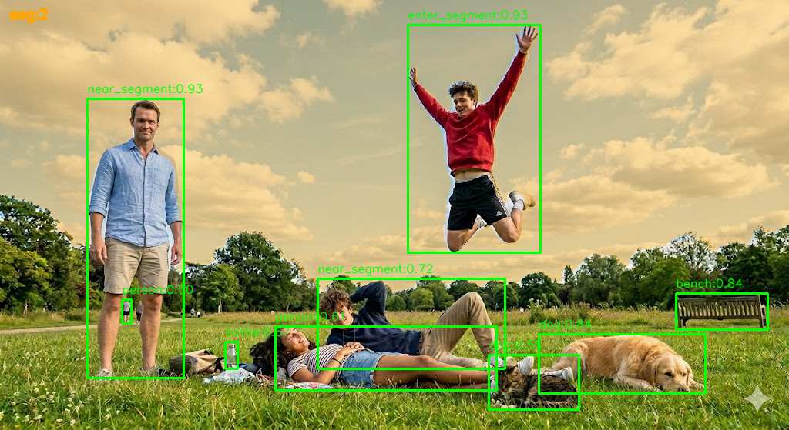

# Vision Alert Service

[中文](README.md) | [English](README.en.md)

视觉告警服务：基于 YOLO 目标检测与 MMSeg 语义分割，面向“区域入侵 / 危险区域接近”类场景提供同步与异步双模式推理能力。

[](https://creativecommons.org/licenses/by-nc/4.0/)



上图展示了项目的一个典型输出：服务先做目标检测，再结合语义分割掩膜对指定类别做业务后处理，将目标标记为 `enter_segment` 或 `near_segment`，而不是只给出通用检测框。

## 项目定位

这是一个面向工程落地的计算机视觉后端服务，而非单纯的模型推理脚本。它将检测模型、分割模型、HTTP API、异步队列、结果存储和运维指标整合为一个可部署的服务，并把原始模型输出进一步转译为业务语义（区域进入、临近告警、结果确认与回溯）。

## 亮点速览

- **双模推理**：支持同步分析接口和异步上传入队接口
- **检测 + 分割联动**：不是只做 object detection，而是做“检测结果的语义增强”
- **业务级告警标签**：根据掩膜重叠率和距离输出 `enter_segment` / `near_segment`
- **零磁盘同步推理**：同步接口支持在内存中完成图片解析与推理，减少 I/O
- **异步消费链路**：Redis Streams + worker 消费线程 + 结果确认流程
- **结构化可观测性**：支持 `X-Request-ID`、JSON 日志、Prometheus 指标
- **开源协作基础**：补齐了贡献指南、安全策略、行为准则和 GitHub 模板
- **容器化交付**：多阶段 Dockerfile，运行时依赖与测试依赖分离

## 这个项目解决什么问题

很多视觉项目在真实场景里会卡在两个地方：

1. 模型只能离线跑 demo，无法稳定对外提供服务
2. 检测结果太“原始”，无法直接映射到业务语义

这个项目试图解决的是第二类“最后一公里工程问题”：

- 输入是一张图片和一组任务规则
- 检测模型找出目标
- 分割模型识别目标区域
- 业务后处理把目标与区域关系转成告警标签
- 服务端以同步或异步形式返回标准化结果

## Demo 图说明

从上面的结果图可以看到：

- `enter_segment`：检测目标与目标分割区域达到进入阈值
- `near_segment`：检测目标未真正进入，但已与目标区域相交或足够接近
- 其他目标仍保留原始检测类别，如 `dog`、`bench`、`bottle`

这意味着系统输出不再只是“识别到了 person”，而是“这个 person 与目标区域处于什么业务关系”。

## 系统架构

```text
Client
  -> FastAPI HTTP layer
    -> AlertService
      -> AlertPipeline
        -> Detector (YOLO)
        -> Segmentor (MMSeg)
      -> AlertStore
        -> Memory / Redis
      -> AlertWorker
        -> Async task consumption
```

调用链拆分在职责上比较明确：

- `app/http`：只负责参数接收、依赖注入、返回响应
- `app/alerting/service.py`：业务编排、上传落盘、同步/异步流程控制
- `app/alerting/pipeline.py`：检测、分割、结果后处理与结果图绘制
- `app/alerting/store.py`：队列、pending、结果和确认逻辑
- `app/alerting/worker.py`：后台消费线程与并发控制
- `app/common`：配置、日志、错误码、指标
- `app/adapters`：Redis 与视觉模型适配层

## 核心能力拆解

### 1. 视觉推理与业务后处理

- 检测模型先给出目标框和类别
- 分割模型对整图输出目标掩膜
- 配置项 `segmentor_target_class_ids` 决定关注哪些分割类别
- 配置项 `segment_postprocess_class_names` 决定哪些检测类别参与业务后处理
- 根据掩膜重叠率和最短距离，输出 `enter_segment` / `near_segment`

### 2. 服务端工程设计

- FastAPI 应用工厂模式，统一注册中间件、异常处理器、生命周期
- 同步接口支持即时返回，异步接口支持上传、入队、拉取结果、确认结果
- Worker 支持并发数与 inflight 上限控制，避免后台消费无限制膨胀
- Store 同时兼容内存模式与 Redis 模式，便于本地开发和生产部署切换

### 3. 可观测性与稳定性

- `GET /healthz`：进程存活检查
- `GET /readyz`：就绪检查，包含 worker / redis / queue 状态
- `GET /metrics`：Prometheus 指标导出
- 请求耗时、推理耗时、队列长度、死信大小都有可观测输出
- 支持 `ALERT_LOG_FORMAT=json` 输出结构化日志
- 支持 `X-Request-ID` 透传，便于串联日志和请求

### 4. 工程质量

- Pydantic v2 配置与模型
- 明确的错误模型与业务异常封装
- 单元测试、集成测试、CI 闸门脚本
- Docker 多阶段构建
- README、部署文档、运维文档、贡献文档分离

## 快速开始

### 本地运行

```bash
python3 -m pip install -r requirements.txt
mkdir -p runtime/log runtime/images/upload runtime/images/result runtime/models/000001
cp runtime/config.example.json runtime/config.json
python3 scripts/install_light_models.py --model-root runtime/models --packs nano-v11-b0
python3 main.py --host 0.0.0.0 --port 8011
```

默认启动后可访问：

- `http://127.0.0.1:8011/docs`
- `http://127.0.0.1:8011/healthz`
- `http://127.0.0.1:8011/readyz`
- `http://127.0.0.1:8011/metrics`

### Docker 运行

```bash
cd docker
docker compose up -d --build
```

容器运行时会挂载：

- 宿主 `runtime/`
- 容器 `/root/.vision_alert`

## API 概览

| 接口 | 方法 | 说明 |
|------|------|------|
| `/api/jobs/upload` | `POST` | 异步上传图片并入队 |
| `/api/jobs/alarm_result` | `GET` | 拉取异步告警结果 |
| `/api/jobs/result_confirm` | `POST` | 确认并清理结果 |
| `/api/analysis/danger` | `POST` | 同步推理，直接返回结果 |
| `/healthz` | `GET` | 存活探针 |
| `/readyz` | `GET` | 就绪探针 |
| `/metrics` | `GET` | Prometheus 指标 |

完整请求/响应字段见 [docs/API.md](docs/API.md)。

## 后处理策略

- 先做目标检测，再对整张图运行语义分割，并取 `alert.segmentor_target_class_ids` 对应掩膜
- 仅对 `alert.segment_postprocess_class_names` 中配置的检测类别应用分割后处理
- 若检测框与目标掩膜重叠比例 `overlapSegment >= alert.in_segment_overlap_ratio`，标记为 `enter_segment`
- 若检测框与目标掩膜有正交集但未达到进入阈值，或中心点到最近掩膜边界距离 `distanceToSegment <= alert.near_segment_distance_px`，标记为 `near_segment`
- 其他检测目标保持原始 `tagName`

默认参数偏保守，实际业务里可以根据误报/漏报情况调整阈值。

## 技术栈

- **Web**：FastAPI, Starlette, Uvicorn
- **配置与模型**：Pydantic v2
- **视觉推理**：PyTorch, Ultralytics, MMEngine, MMSegmentation, MMCV
- **图像处理**：OpenCV
- **异步结果存储**：Redis
- **质量保障**：pytest, unittest, Ruff
- **交付**：Docker, Docker Compose, GitHub Actions

## 关键环境变量

| 变量 | 说明 | 默认 |
|------|------|------|
| `ALERT_LOG_FORMAT` | `json` 启用 JSON 结构化日志 | 文本格式 |
| `ALERT_DET_DEVICE` | 检测设备（`cpu` / `cuda:0`） | `cpu` |
| `ALERT_SEG_DEVICE` | 分割设备（`cpu` / `cuda:0`） | `cpu` |
| `ALERT_UPLOAD_MAX_BYTES` | 单张上传最大字节数 | `20971520` |
| `ALERT_IMAGE_RETENTION_DAYS` | 图片保留天数 | `30` |
| `ALERT_WORKER_THREADS` | 后台 worker 并发线程数 | `4` |
| `ALERT_WORKER_MAX_INFLIGHT` | 最大并发处理中任务数 | `64` |

完整配置与部署细节见 [docs/DEPLOYMENT.md](docs/DEPLOYMENT.md)。

## 项目结构

```text
app/
  common/      # 配置、日志、异常、指标
  adapters/    # Redis / 模型适配器
  alerting/    # service、pipeline、store、worker、schema
  http/        # API 路由
  application.py
main.py
tests/
scripts/
docs/
docker/
runtime/
```

## 开发与测试

```bash
# 安装 CI 依赖
python3 -m pip install -r requirements-ci.txt

# 运行测试
python3 scripts/ci_unittest_gate.py
pytest

# 代码检查
ruff check app tests scripts
ruff format --check app tests scripts

# 构建测试镜像
docker build -f docker/Dockerfile --target test -t vision-alert:test .
docker run --rm -v "$(pwd)/runtime:/root/.vision_alert" vision-alert:test
```

工程侧已经覆盖的点包括：

- CI 闸门脚本，防止“测试发现为 0”或大面积跳过
- HTTP 路由、worker 生命周期、配置加载、指标、service/store/pipeline 测试
- Docker 运行依赖与测试依赖分离

## 文档导航

| 文档 | 说明 |
|------|------|
| [docs/API.md](docs/API.md) | HTTP 接口规范 |
| [docs/DEPLOYMENT.md](docs/DEPLOYMENT.md) | 部署配置、环境变量、Docker |
| [docs/OPERATIONS.md](docs/OPERATIONS.md) | 运维基线、Prometheus 面板、告警阈值 |
| [docs/CALL_CHAIN.md](docs/CALL_CHAIN.md) | 调用链与架构说明 |
| [docs/CONTAINER_TEST.md](docs/CONTAINER_TEST.md) | 容器 GPU 测试步骤 |
| [CONTRIBUTING.md](CONTRIBUTING.md) | 贡献流程、提交前检查、PR 约定 |
| [SECURITY.md](SECURITY.md) | 漏洞报告与安全披露流程 |
| [CODE_OF_CONDUCT.md](CODE_OF_CONDUCT.md) | 社区协作行为基线 |

## 开源协作

- 新贡献请先阅读 [CONTRIBUTING.md](CONTRIBUTING.md)
- 安全问题请参考 [SECURITY.md](SECURITY.md)
- 社区协作行为见 [CODE_OF_CONDUCT.md](CODE_OF_CONDUCT.md)

## 许可证

本项目采用 [CC BY-NC 4.0](LICENSE) 许可证。**禁止将本项目用于任何商业目的。**
